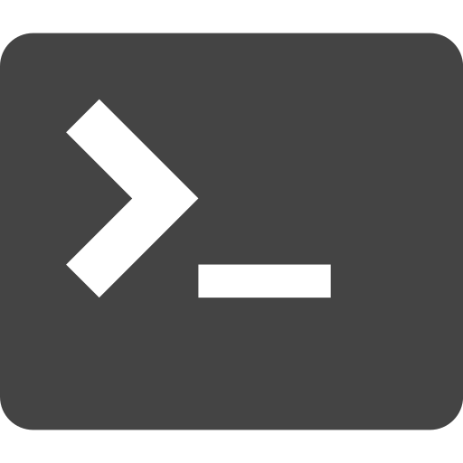

# Hi there, I'm Lucas 👋 
## I'm a College Student, Front-End Developer, and Knowledge Thirsty Person!!

- 🌱 I’m currently learning ReactJS 
- 👯 I’m looking to grow by working with other web developers
- 📆 2022 Goals: Have a deeper understanding of the programming fundamentals
- ⚡ Fun fact: I love meeting new people and getting to know their life stories

### Connect with me:

### Languages and Tools:

